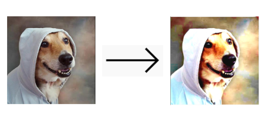

# Flutter Bitmap

[](https://pub.dartlang.org/packages/bitmap)

A minimalist [Flutter](https://flutter.dev/) package to perform fast bitmaps operations.
The focus here is to provide a cool bitmap manipulation interface.

The package standard format is [RGBA32](https://en.wikipedia.org/wiki/RGBA_color_space).

Bitmap uses the Dart FFI to perform operations such as contrast, brightness, saturation, and exposure.

For now, things like format encoding, EXIF and multi-frame images are not the concern of this package. If that is your need, check [`image`](https://pub.dartlang.org/packages/image).
Some of the algorithms here are heavily inspired by this awesome lib.

## Why this exists?

I started to use [dart image](https://pub.dartlang.org/packages/image) to create [LetsPicture](https://github.com/renancaraujo/letspicture/) (cool app, check it out) but since the beginning, I've noticed that the performance was really bad.
[Dart image](https://pub.dartlang.org/packages/image) has its own Image format, so between decoding, putting some transformations and then displaying the result on the app you had to convert the image two times (at least).

So this package is just this: We deal [bitmaps](https://en.wikipedia.org/wiki/BMP_file_format) (duh) and we focus only on Flutter use cases.

`bitmap` takes some advantages from Flutter:
- Every image is decoded to [RGBA32](https://en.wikipedia.org/wiki/RGBA_color_space) by the framework trough ImageStreamListener, so we can rely on Flutter to do the decoding job;
- Dart FFI: we are porting some of our functions to C (or C++) making it blazing fast.
- With this package, you can easily take advantage of stuff like [compute](https://api.flutter.dev/flutter/foundation/compute.html) ([Isolates](https://www.didierboelens.com/2019/01/futures---isolates---event-loop/)) on only the manipulations you want to free the UI thread of heavy computation.
- [Niks](https://github.com/renancaraujo/niks) Want to create your own image editor? Niks and bitmap are awesome for the job.

## Alternatives

#### Dart image

As mentioned previously, [`check on pub`](https://pub.dartlang.org/packages/image).

#### Flutter Built-in ColorFilter class

Flutter has a powerful [ColorFilter](https://api.flutter.dev/flutter/dart-ui/ColorFilter-class.html) class (that came from [skia](https://skia.org/user/api/skpaint_overview#SkColorFilter)) which can be used to put some color corrections when painting stuff on canvas. You can use a matrix to correct color (Some matrix examples [here](https://docs.rainmeter.net/tips/colormatrix-guide/)).
Not every color transformation can be done through the matrix, though. 

## Basic usage

### 1. Image to Bitmap

Everything is around the [Bitmap](https://pub.dev/documentation/bitmap/latest/bitmap/bitmap-library.html) class. You can get an instance of that from any [ImageProvider](https://api.flutter.dev/flutter/painting/ImageProvider-class.html).

```dart
import 'package:bitmap/bitmap.dart';

Bitmap bitmap = await Bitmap.fromProvider(NetworkImage("http://pudim.com.br/pudim.jpg")); // Notice this is an async operation
```

##### You can create from a headed [Uint8List](https://api.flutter.dev/flutter/dart-typed_data/Uint8List-class.html):

```dart
import 'package:bitmap/bitmap.dart';

Bitmap bitmap = Bitmap.fromHeadful(imageWidth, imageHeight, theListOfInts); // Not async
```

##### Or a headless:

```dart
Bitmap bitmap = Bitmap.fromHeadless(imageWidth, imageHeight, theListOfInts); // Not async
```
This is useful when you are dealing with the [Uint8List](https://api.flutter.dev/flutter/dart-typed_data/Uint8List-class.html) that [ByteData](https://api.flutter.dev/flutter/dart-typed_data/ByteData-class.html) generates.

##### You can even create a blank one

```dart
Bitmap bitmap = Bitmap.blank(imageWidth, imageHeight);
```
This creates a black, full transparent bitmap.

### 2. Applying some operations

Let's put some contrast
```dart
import 'package:bitmap/bitmap.dart';

Bitmap contrastedBitmap = bitmap.apply(BitmapContrast(0.2));;
```

It is possible to add several operations at once
```dart
import 'package:bitmap/bitmap.dart';
Bitmap brightBitmap = bitmap.applyBatch([
  BitmapBrightness(0.2),
  BitmapAdjustColor(
    saturation: 1.0
  ),
]);
```

### 3. Displaying/painting/saving the output

You can create two outputs from a `Bitmap` instance:
- A `Uint8List` with no header, only the content of the file (`.content` property).
- A `Uint8List` with a bitmap header, which Flutter can parse (`.buildHeaded()` method).

##### Displaying

To easiest way to display an image is to getting the bitmap with header and then passing it to the widget `Image.memory`:
```dart
// ..

Uint8List headedBitmap = bitmap.buildHeaded();

// ..
child: Image.memory(headedBitmap)
// ..
```

##### Painting

The `Bitmap` class has also a helper function `buildImage`  that uses Flutter's `decodeImageFromList` to build a [`dart:ui Image`](https://api.flutter.dev/flutter/dart-ui/Image-class.html).
With an `Image`, you can [paint it in a canvas](https://api.flutter.dev/flutter/dart-ui/Canvas/drawImage.html) (in a [CustomPainter](https://api.flutter.dev/flutter/rendering/CustomPainter-class.html), for example).

```dart
import 'dart:ui' as ui;
// ..
ui.Image outputImage = await bitmap.buildImage();
canvas.drawImage(outputImage, Offset.zero, ui.Paint());
```

##### Saving

You can also save the image as a `.bmp` file (get the file content with the `.buildHeaded()` method).
You can check also the [`image`](https://pub.dartlang.org/packages/image) lib where you can save the image in several formats.

[How to save files with Flutter?](https://flutter.dev/docs/cookbook/persistence/reading-writing-files)

## Performance improvements and Dart FFI

### Dart FFI

The capability of calling a `c` (or `c++`) function from dart can help us a lot in getter better performance times.

### Isolates

Most of the manipulations on the bitmap take a long time to be completed. That's is because they have to iterate on every item of the bitmap.
A picture with a 400px width and height sizes will generate a list of 640000 integers.  This is a heavy computation.
Those can be expensive. Sou you may use [Isolates](https://www.didierboelens.com/2019/01/futures---isolates---event-loop/) there to free the UI thread from all of this work.

Check the [example app](https://github.com/renancaraujo/bitmap), where the transformations are applied through the compute function. 

**Important: it is noticed that the performance increases a lot when using release mode on your Flutter App**

## Apps using it (only one for now)

- [Lets Picture](https://github.com/renancaraujo/letspicture) - [Play store](https://play.google.com/store/apps/details?id=app.letspicture.letspicture) and the [source code](https://github.com/renancaraujo/letspicture).

## Supported operations

- Flip vertical
- Flip horizontal
- Rotation
- Resize (nearest interpolation)
- Contrast
- Brightness
- Saturation
- Exposure
- Crop

## Todo

There is a lot of work to be done:

- [ ] Resize with other interpolations
- [ ] Set channel
- [ ] White balance
- [ ] Color blend
- [ ] Noise
- [ ] Tones
- [ ] ??? The sky is the limit
